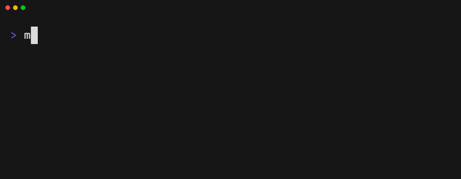

<p align="center">
  
</p>

<p align="center">
  On-device PII anonymization for AI workflows.<br/>
  Detects, replaces, encrypts — and rehydrates back when needed.
</p>

<p align="center">
  <a href="https://docs.rehydra.ai">Documentation</a> · <a href="https://github.com/rehydra-ai/rehydra-sdk/issues">Issues</a>
</p>

<p align="center">
  <a href="https://www.npmjs.com/package/rehydra"></a>
  <a href="https://github.com/rehydra-ai/rehydra-sdk/blob/main/LICENSE"></a>
  <a href="https://codecov.io/github/rehydra-ai/rehydra"></a>
</p>

<p align="center">
  <code>npm i rehydra</code> · <code>npm i <a href="packages/cli/">@rehydra/cli</a></code> · <code>npm i <a href="packages/opencode-plugin/">@rehydra/opencode</a></code>
</p>

---

<p align="center">
  
</p>   

## Quick Start

```typescript
import { anonymize } from 'rehydra';

const { anonymizedText } = await anonymize(
  'Email john.smith@acme-corp.com or call John at +41 79 123 45 67'
);
// → "Email <PII type="EMAIL" id="1"/> or call <PII type="PERSON" id="2"/> at <PII type="PHONE" id="3"/>"
```

Works in **Node.js**, **Bun**, and **browsers**. No data leaves your machine.

## Features

- **Regex + NER detection** — emails, phones, IBANs, credit cards, names, orgs, locations, and more
- **LLM Proxy** — drop-in `fetch` wrapper or standalone proxy server for OpenAI, Anthropic, and compatible APIs
- **Streaming** — Transform stream with low-latency mode for real-time LLM token streams
- **Sessions** — consistent PII IDs across multi-message conversations with persistent storage
- **Encryption** — AES-256-GCM via Web Crypto API
- **Semantic enrichment** — optional gender/scope attributes for better machine translation

## Example: Full Round-Trip with NER and Sessions

```typescript
import {
  createAnonymizer,
  decryptPIIMap,
  rehydrate,
  InMemoryKeyProvider,
  SQLitePIIStorageProvider,
} from 'rehydra';

const keyProvider = new InMemoryKeyProvider();
const anonymizer = createAnonymizer({
  ner: {
    mode: 'quantized',              // ~280 MB model, auto-downloads on first use
    caseFallback: true,             // detect lowercase names like "tom"
    thresholds: { PERSON: 0.8 },   // require higher confidence for names
    onStatus: console.log,          // log model download progress
  },
  semantic: { enabled: true },      // adds gender/scope attributes for MT
  secrets: { enabled: true },       // detect API keys, JWTs, connection strings
  keyProvider,
  piiStorageProvider: new SQLitePIIStorageProvider('./pii.db'),
});

const session = anonymizer.session('chat-123');

// Message 1 — NER detects names and orgs, regex catches emails
const r1 = await session.anonymize(
  'Tell John Smith at Acme Corp (john.smith@acme-corp.com) we accept the offer'
);
// → "Tell <PII type="PERSON" gender="male" id="1"/> at <PII type="ORG" id="2"/>
//    (<PII type="EMAIL" id="3"/>) we accept the offer"

// Message 2 — same entities keep their IDs across messages
const r2 = await session.anonymize(
  'CC john.smith@acme-corp.com and loop in admin@acme-corp.com'
);
// → "CC <PII type="EMAIL" id="3"/> and loop in <PII type="EMAIL" id="4"/>"

// Rehydrate any message — PII map is loaded from SQLite automatically
const original = await session.rehydrate(r2.anonymizedText);
// → "CC john.smith@acme-corp.com and loop in admin@acme-corp.com"

await anonymizer.dispose();
```

## Packages

| Package | Description |
|---------|-------------|
| [`rehydra`](https://www.npmjs.com/package/rehydra) | Core SDK |
| [`@rehydra/cli`](packages/cli/) | Anonymize and rehydrate from the terminal |
| [`@rehydra/opencode`](packages/opencode-plugin/) | OpenCode plugin — scrubs secrets before they reach LLM providers |

## Documentation

For API reference, configuration, guides, and examples, visit **[docs.rehydra.ai](https://docs.rehydra.ai)**.

## License

[MIT](LICENSE)
